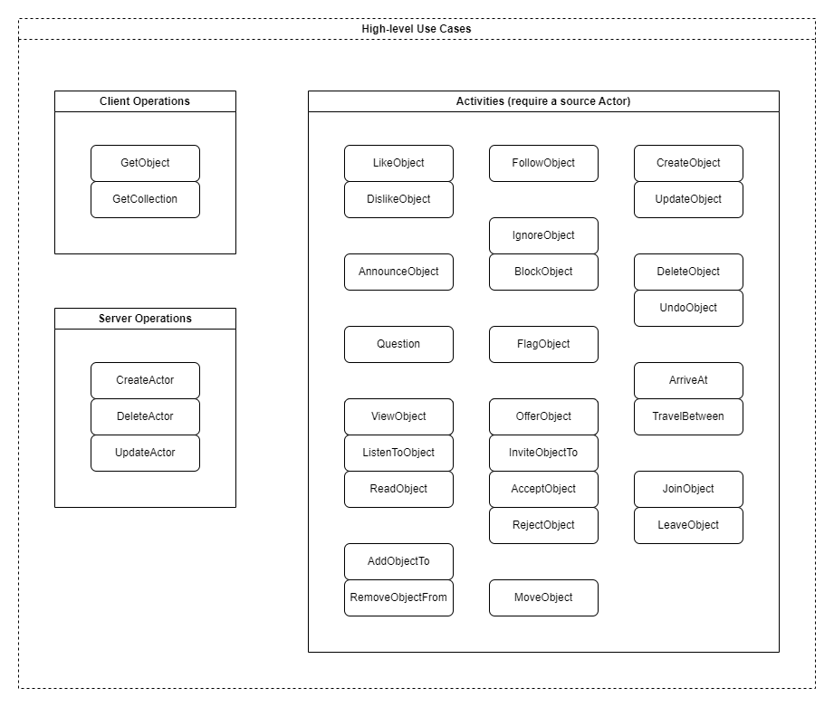

# Use Cases

Business logic within ActivityPubSharp is based on a collection of small, atomic "use cases" that each implement a high-level function.
Two types of use cases exist: **high-level** and **low-level**.
High-level use cases look much like you would expect.
They are highly abstracted from the library internals and represent a distinct function that user may wish to perform.

Low-level use cases, on the other hand, deviate from the typical pattern.
They provide thin abstractions over simple routines and functions that would normally be implemented as services or mappers.
We take this unusual approach because ActivityPubSharp is first and foremost a library, with a distinct expectation of being wrapped by even higher level business logic or 3rd party integrations.
Other patterns are too rigid and would force all library users to adopt the same design, which may not even be possible.
To ease usage and integration, we adopt **library users** as an additional first-class user type alongside the *actual* end users.
High-level cases are for end users, low-level cases are for library users.

## Traits of a Use Case

All use cases, low or high, share the following traits:
* Stateless
* Have a public interface and separate implementation class
* Injected through DI as singletons
* Self-contained, but can compose over other use cases through DI
* Accept a dedicated options type, which exposes static configuration and extension hooks

This provides a good balance between flexibility and ease of use, while also promoting clean code and maintainability.
Additionally, this assists with unit testing and can be easily integrated into a variety of existing application architectures.

## List of Use Cases

### The following high-level use cases are available:

#### Client Operations
* `GetCollection` - Enumerates elements of a local or remote collection, with optional pagination and authentication.
* `GetObject` - Accesses a local or remote object, with optional authentication.

#### Server Operations
* `CreateActor` - Creates a new actor locally.
* `DeleteActor` - Deletes a local actor and all related data.
* `UpdateActor` - Updates a local actor.

#### Activities
* `AcceptObject` - Emits an [`Accept` activity](https://www.w3.org/TR/activitystreams-vocabulary/#dfn-accept) for an object. Existing fedi software only accepts this in response to a follow request.
* `AddObjectTo` - Emits an [`Add` activity](https://www.w3.org/TR/activitystreams-vocabulary/#dfn-add) for a provided object and target collection. Implicitly undoes any previous `RemoveObjectFrom`. This is like Mastodon's "Pin to Profile" feature.
* `AnnounceObject` - Emits an [`Announce` activity](https://www.w3.org/TR/activitystreams-vocabulary/#dfn-announce) for a provided object. This is like Mastodon's "Boost" function.
* `ArriveAt` - Emits an [`Arrive` activity] for a provided location. This is not implemented by any known fedi software.
* `BlockObject` - Emits a [`Block` activity](https://www.w3.org/TR/activitystreams-vocabulary/#dfn-block) for a provided object. This is like Mastodon's "Block" feature. While this *can* be issued for any arbitrary object, existing fedi software only supports following `Actor` types.
* `CreateObject` - Emits a [`Create` activity](https://www.w3.org/TR/activitystreams-vocabulary/#dfn-create) for a provided object. This is like Mastodon's "Post" feature.
* `DeleteObject` - Emits a [`Delete` activity](https://www.w3.org/TR/activitystreams-vocabulary/#dfn-delete) for a provided object. This is like Mastodon's "Delete" feature.
* `DislikeObject` - Emits a [`Dislike` activity](https://www.w3.org/TR/activitystreams-vocabulary/#dfn-dislike) for a provided object. Implicitly undoes any previous `LikeObject`. This is like Lemmy's "Downvote" function.
* `FlagObject` - Emits a [`Flag` activity](https://www.w3.org/TR/activitystreams-vocabulary/#dfn-flag) for a provided object. This is like Mastodon's "Report" feature.
* `FollowObject` - Emits a [`Follow` activity](https://www.w3.org/TR/activitystreams-vocabulary/#dfn-follow) for a provided object. This is like Mastodon's "Follow" and "Follow Request" features. While this *can* be issued for any arbitrary object, existing fedi software only supports following `Actor` types.
* `IgnoreObject` - Emits an [`Ignore` activity](https://www.w3.org/TR/activitystreams-vocabulary/#dfn-ignore) for a provided object. This is not implemented by any known fedi software.
* `InviteObjectTo` - Emits an [`Invite` activity](https://www.w3.org/TR/activitystreams-vocabulary/#dfn-invite) for a provided object and target. This is like `OfferObject`, but extends the offer to a specific target. `Invite` activities are not implemented by any known fedi software.
* `JoinObject` - Emits a [`Join` activity](https://www.w3.org/TR/activitystreams-vocabulary/#dfn-join) for a provided object. Implicitly undoes any previous `LeaveObject`. This is not implemented by any known fedi software.
* `LeaveObject` - Emits a [`Leave` activity](https://www.w3.org/TR/activitystreams-vocabulary/#dfn-leave) for a previously-joined object. Implicitly undoes any previous `JoinObject`. This is not implemented by any known fedi software.
* `LikeObject` - Emits a [`Like` activity](https://www.w3.org/TR/activitystreams-vocabulary/#dfn-like) for a provided object. Implicitly undoes any previous `DislikeObject`. This is like Mastodon's "Favorite" function.
* `ListenToObject` - Emits a [`Listen` activity](https://www.w3.org/TR/activitystreams-vocabulary/#dfn-listen) for a provided object. This is like `ViewObject` but for audio.
* `MoveObject` - Emits a [`Move` activity](https://www.w3.org/TR/activitystreams-vocabulary/#dfn-move) for a provided object and target. Any two objects can be provided, but existing fedi software only supports actors. This is like Mastodon's "Account Migration" feature.
* `OfferObject` - Emits an [`Offer` activity](https://www.w3.org/TR/activitystreams-vocabulary/#dfn-offer) for a provided object. This is not implemented by any known fedi software.
* `Question` - Emits a [`Question` activity](https://www.w3.org/TR/activitystreams-vocabulary/#dfn-question). This is like Mastodon's "Poll" post type.
* `ReadObject` - Emits a [`Read` activity](https://www.w3.org/TR/activitystreams-vocabulary/#dfn-read) for a provided object. This is like a read receipt, and is not implemented by any known fedi software.
* `RejectObject` - Emits a [`Reject` activity](https://www.w3.org/TR/activitystreams-vocabulary/#dfn-reject) for an object. Existing fedi software only accepts this in response to a follow request.
* `RemoveObjectFrom` - Emits a [`Remove` activity](https://www.w3.org/TR/activitystreams-vocabulary/#dfn-remove) for a provided object and target collection. Implicitly undoes any previous `AddObjectTo`. This is like Mastodon's "Unpin from Profile" feature.
* `TravelBetween` - Emits a [`Travel` activity](https://www.w3.org/TR/activitystreams-vocabulary/#dfn-travel) for a provided destination and/or source. This is not implemented by any known fedi software.
* `UndoObject` - Emits an [`Undo` activity](https://www.w3.org/TR/activitystreams-vocabulary/#dfn-undo) for a provided activity. While it is *possible* to provide any arbitrary object, the semantics are undefined and not supported by any known fedi software. Make good choices - only `Undo` activities!
* `UpdateObject` - Emits an [`Update` activity](https://www.w3.org/TR/activitystreams-vocabulary/#dfn-update) for a provided object. This is like Mastodon's "Edit" feature.
* `ViewObject` - Emits a [`View` activity](https://www.w3.org/TR/activitystreams-vocabulary/#dfn-view) for a provided object. This is like `ViewObject` but for images.

### The following low-level use cases are available:

(not yet implemented)